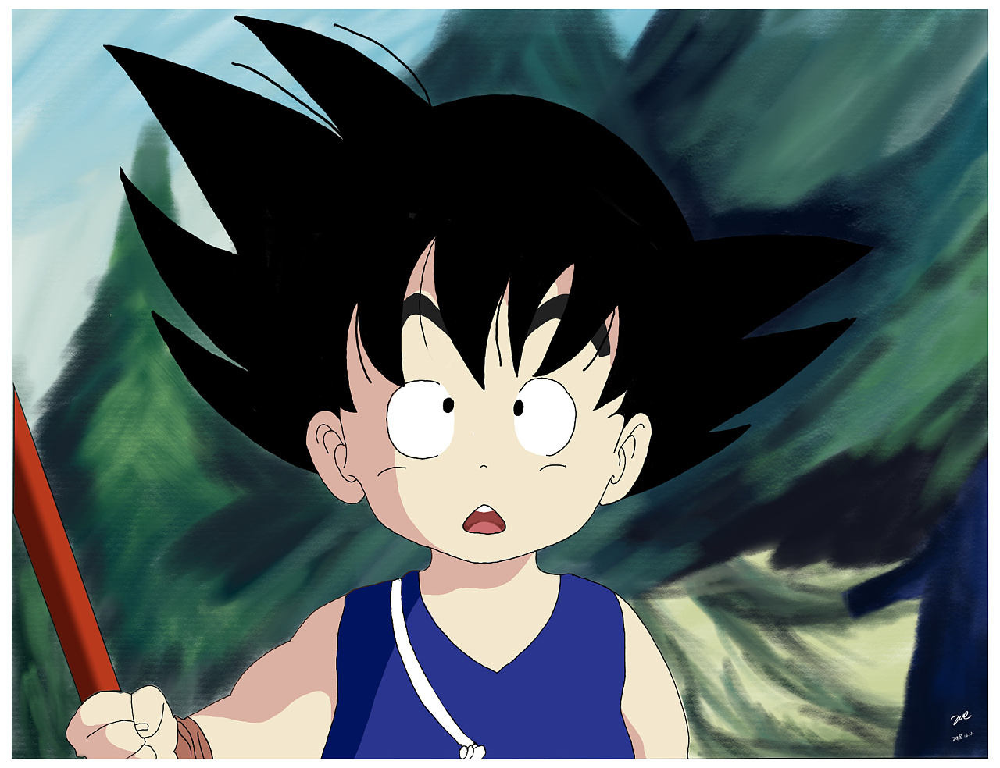

<!-- Improved compatibility of back to top link: See: https://github.com/othneildrew/Best-README-Template/pull/73 -->

<!--
*** Thanks for checking out the Best-README-Template. If you have a suggestion
*** that would make this better, please fork the repo and create a pull request
*** or simply open an issue with the tag "enhancement".
*** Don't forget to give the project a star!
*** Thanks again! Now go create something AMAZING! :D
-->

<!-- PROJECT SHIELDS -->
<!--
*** I'm using markdown "reference style" links for readability.
*** Reference links are enclosed in brackets [ ] instead of parentheses ( ).
*** See the bottom of this document for the declaration of the reference variables
*** for contributors-url, forks-url, etc. This is an optional, concise syntax you may use.
*** https://www.markdownguide.org/basic-syntax/#reference-style-links
-->

[![Contributors][contributors-shield]][contributors-url]
[![Forks][forks-shield]][forks-url]
[![Stargazers][stars-shield]][stars-url]
[![Issues][issues-shield]][issues-url]
<!-- [![MIT License][license-shield]][license-url] -->

<!-- PROJECT LOGO -->
 

  

<h1 align="center">AgriMind</h1>

  

    AgriMind: The smart ally that every farmer truly needs.
     
    <a href="https://github.com/JimmylearningCoding/AgriMind"><strong>Explore the project »</strong></a>
     
     
    <a href="https://github.com/JimmylearningCoding/AgriMind">View Demo</a>
    ·
    <a href="https://github.com/JimmylearningCoding/AgriMind/issues/new?labels=bug&template=bug-report---.md">Report Bug</a>
    ·
    <a href="https://github.com/JimmylearningCoding/AgriMind/issues/new?labels=enhancement&template=feature-request---.md">Request Feature</a>
  

<!-- TABLE OF CONTENTS -->

  
Table of Contents

  <ol>
    <li>
      <a href="#News">News</a>
    </li>
    <li>
      <a href="#About The Project">About The Project</a>
    </li>
    <li>
      <a href="#Built With">Built With</a>
    </li>
    <li>
      <a href="#Demo">Demo</a>
    </li>
    <li><a href="#Model Collection">Model Collection</a></li>
    <li><a href="#Future Plan">Future Plan</a></li>
    <li><a href="#Quick Start">Quick Start</a></li>
    <li><a href="#License">License</a></li>
    <li><a href="#Contact">Contact</a></li>
    <li><a href="#Acknowledgments">Acknowledgments</a></li>
    <li><a href="#Star History">Star History</a></li>
  </ol>

<!-- Latest News -->
# News
- 2025/1/8 We upload AgriMind_Qwen2.5_7b_instruct_v1.
- 2025/1/8 we upload AgriMind_Internlm2_7b_chat_v1.

(<a href="#readme-top">back to top</a>)

<!-- ABOUT THE PROJECT -->

# About The Project
### 初代架构图
[![Product Name Screen Shot][product-screenshot]](https://example.com)
### 真正面向广大农民
在中国，农民受教育程度低是社会广泛普遍的认知，这带给我们的思考是——农民在使用软件/大模型的时候，问题输入会直白粗略的，如何让大模型理解这些粗略直白问题并且给到简单直接的回答？
我们推出AgriMind——一款聚焦农业领域的智能问答大模型。AgriMind如同农田里的"诸葛孔明",为广大农民提供准确科学解答和决策支持，用LLM助力丰收。

### 农作物百事通
通过微调各大系列大模型，构建出聚焦与农业领域的智能问答大模型，支持以下3个问题类型，9个细分场景。
- 农作物问题：病害诊断、施肥建议、种植技术
- 畜牧养殖问题：疾病诊断、饲料配比、养殖环境管理
- 农具与农业机械使用：基础操作指南、常见故障诊断、日常保养与维护
-  

|   名称   |   底座   |   版本   |   微调方法   |  地址  | 
|   ---   | ---   | ---   | ---   | --- |  --- |
|   AgriMind_Qwen2.5_7b_instruct_v1   |   Qwen2.5_7b_instruct   |   V1.0   |  Lora  |    |
|   AgriMind_Internlm2_7b_chat_v1   |   InternLM2-Chat-7B   |   V1.0   |  Lora    |    |
|   1   |   2   |   3   |   4   |    |
|   1   |   2   |   3   |   4   |    |

(<a href="#readme-top">back to top</a>)

<!-- Project Highlights -->

# Project Highlights

(<a href="#readme-top">back to top</a>)

<!-- Built With -->
# Built With

<!-- * [![Next][Next.js]][Next-url]
* [![React][React.js]][React-url]
* [![Vue][Vue.js]][Vue-url]
* [![Angular][Angular.io]][Angular-url]
* [![Svelte][Svelte.dev]][Svelte-url]
* [![Laravel][Laravel.com]][Laravel-url]
* [![Bootstrap][Bootstrap.com]][Bootstrap-url]
* [![JQuery][JQuery.com]][JQuery-url] -->

(<a href="#readme-top">back to top</a>)

<!-- Demo -->

# Demo

(<a href="#readme-top">back to top</a>)

<!-- Model Collection -->

# Model Collection

(<a href="#readme-top">back to top</a>)

<!-- Future Plan -->
# Future Plan

(<a href="#readme-top">back to top</a>)

<!-- Quick Start -->

# Quick Start

(<a href="#readme-top">back to top</a>)

<!-- Top contributors -->
# Top Contributors

<!-- LICENSE -->

# License

Distributed under the MIT License. See `LICENSE` for more information.

(<a href="#readme-top">back to top</a>)

<!-- CONTACT -->

# Contact

Ziming He - [@twitter_handle](https://twitter.com/twitter_handle) - heziming0619@163.com

Project Link: [https://github.com/JimmylearningCoding/AgriMind](https://github.com/JimmylearningCoding/AgriMind)

(<a href="#readme-top">back to top</a>)

<!-- ACKNOWLEDGMENTS -->

# Acknowledgments

(<a href="#readme-top">back to top</a>)

<!-- Star History -->
# Star History

<!-- MARKDOWN LINKS & IMAGES -->
<!-- https://www.markdownguide.org/basic-syntax/#reference-style-links -->

[contributors-shield]: https://img.shields.io/github/contributors/JimmylearningCoding/AgriMind.svg?style=for-the-badge
[contributors-url]: https://github.com/JimmylearningCoding/AgriMind/graphs/contributors
[forks-shield]: https://img.shields.io/github/forks/JimmylearningCoding/AgriMind.svg?style=for-the-badge
[forks-url]: https://github.com/JimmylearningCoding/AgriMind/network/members
[stars-shield]: https://img.shields.io/github/stars/JimmylearningCoding/AgriMind.svg?style=for-the-badge
[stars-url]: https://github.com/JimmylearningCoding/AgriMind/stargazers
[issues-shield]: https://img.shields.io/github/issues/JimmylearningCoding/AgriMind.svg?style=for-the-badge
[issues-url]: https://github.com/JimmylearningCoding/AgriMind/issues
[license-shield]: https://img.shields.io/github/license/JimmylearningCoding/AgriMind.svg?style=for-the-badge
[license-url]: https://github.com/JimmylearningCoding/AgriMind/blob/master/LICENSE.txt
[linkedin-shield]: https://img.shields.io/badge/-LinkedIn-black.svg?style=for-the-badge&logo=linkedin&colorB=555
[linkedin-url]: https://linkedin.com/in/linkedin_username
[product-screenshot]: images/Diagram.png
[Next.js]: https://img.shields.io/badge/next.js-000000?style=for-the-badge&logo=nextdotjs&logoColor=white
[Next-url]: https://nextjs.org/
[React.js]: https://img.shields.io/badge/React-20232A?style=for-the-badge&logo=react&logoColor=61DAFB
[React-url]: https://reactjs.org/
[Vue.js]: https://img.shields.io/badge/Vue.js-35495E?style=for-the-badge&logo=vuedotjs&logoColor=4FC08D
[Vue-url]: https://vuejs.org/
[Angular.io]: https://img.shields.io/badge/Angular-DD0031?style=for-the-badge&logo=angular&logoColor=white
[Angular-url]: https://angular.io/
[Svelte.dev]: https://img.shields.io/badge/Svelte-4A4A55?style=for-the-badge&logo=svelte&logoColor=FF3E00
[Svelte-url]: https://svelte.dev/
[Laravel.com]: https://img.shields.io/badge/Laravel-FF2D20?style=for-the-badge&logo=laravel&logoColor=white
[Laravel-url]: https://laravel.com
[Bootstrap.com]: https://img.shields.io/badge/Bootstrap-563D7C?style=for-the-badge&logo=bootstrap&logoColor=white
[Bootstrap-url]: https://getbootstrap.com
[JQuery.com]: https://img.shields.io/badge/jQuery-0769AD?style=for-the-badge&logo=jquery&logoColor=white
[JQuery-url]: https://jquery.com
