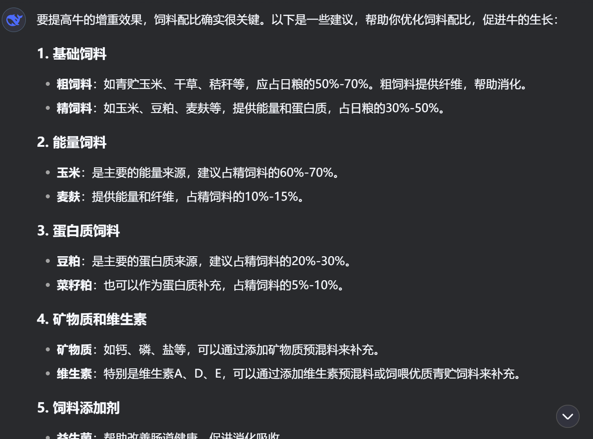
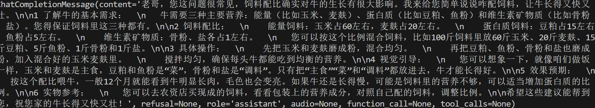

# 模型微调说明过程文档（以Qwen2.5_7b_instruct作为例子）

## 🤖 1. 环境准备
1.1 Ubuntu
- Python 3.10.16
- Pytorch 2.5.1
- GPU A100(24GB)

1.2 LLaMA-Factory框架
```shell
git clone https://github.com/hiyouga/LLaMA-Factory.git  
cd LLaMA-Factory   
pip install -e .  
```
1.3 训练数据集准备  
举个例子：
将训练数据放在 `LLaMA-Factory/data`里面  
然后修改数据配置文件： `LLaMA-Factory/data/dataset_info.json` 
```shell
"xxx": {
  "file_name": "xxx.json",
  "columns": {
    "prompt": "instruction",
    "query": "input",
    "response": "output"
  }
}
```

## ⚙️ 2. 模型准备
```shell
pip install -U huggingface_hub
pip install huggingface-cli

huggingface-cli download --resume-download Qwen/Qwen2.5-7B-Instruct --local-dir '这里自己指定地址'

```


## 🛠️ 3. 模型微调

## ⏬ 4. 模型部署


对应同样的输入   
使用通用大模型的效果：    
  


微调之后的效果：更加亲切直白，跟农民伯伯的距离感没那么强  
  